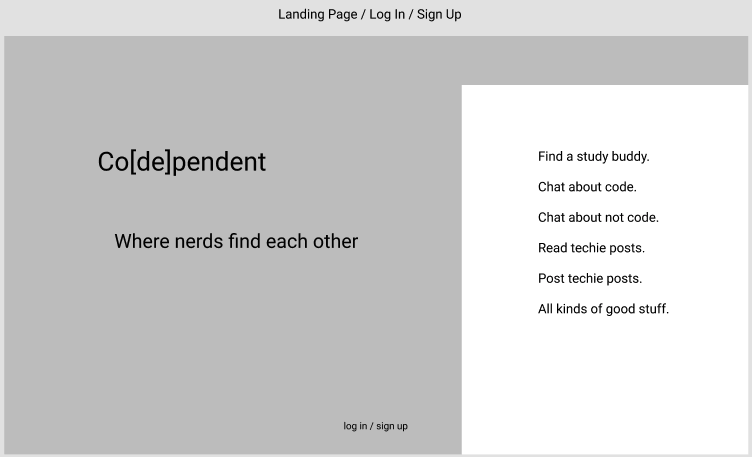
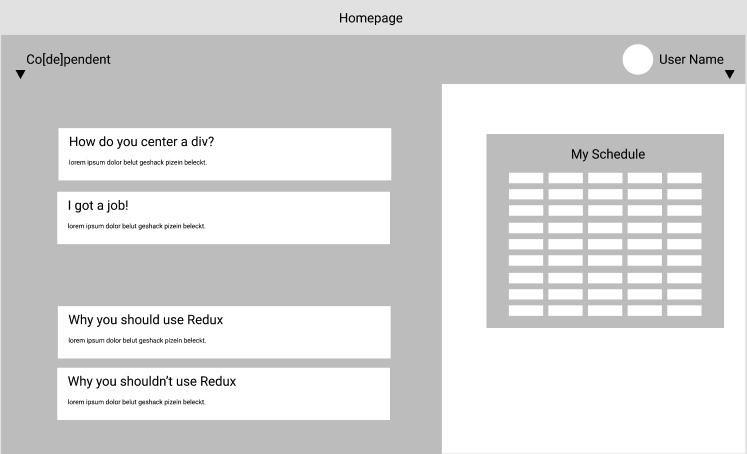
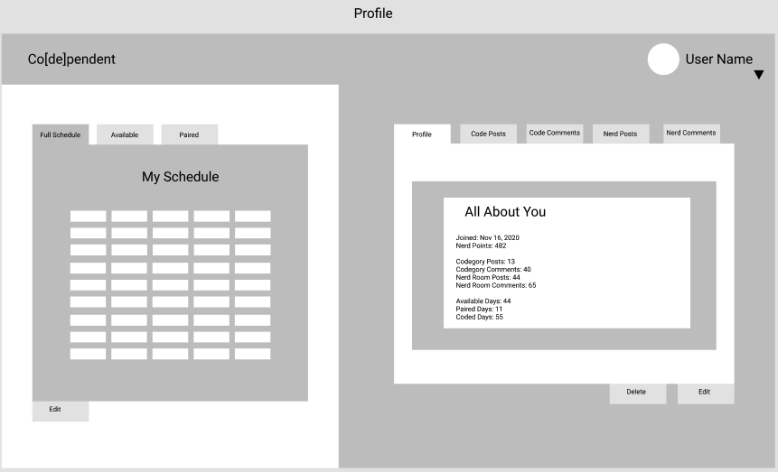
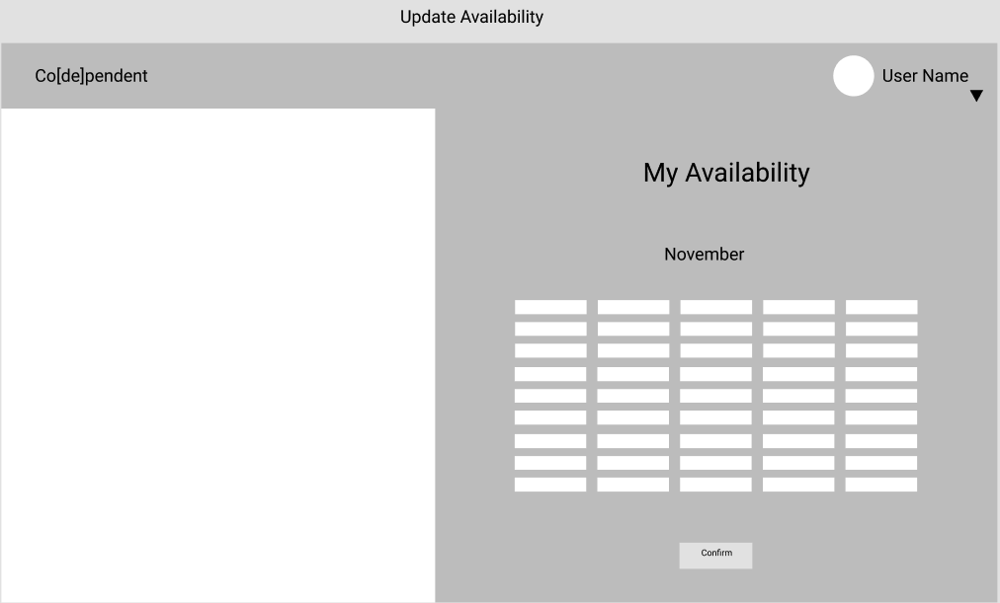
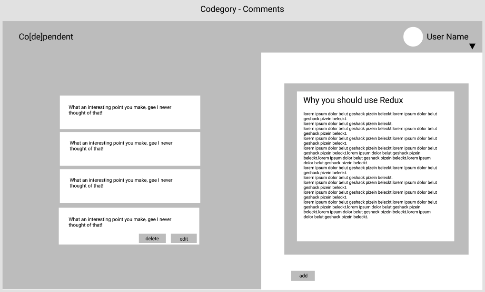
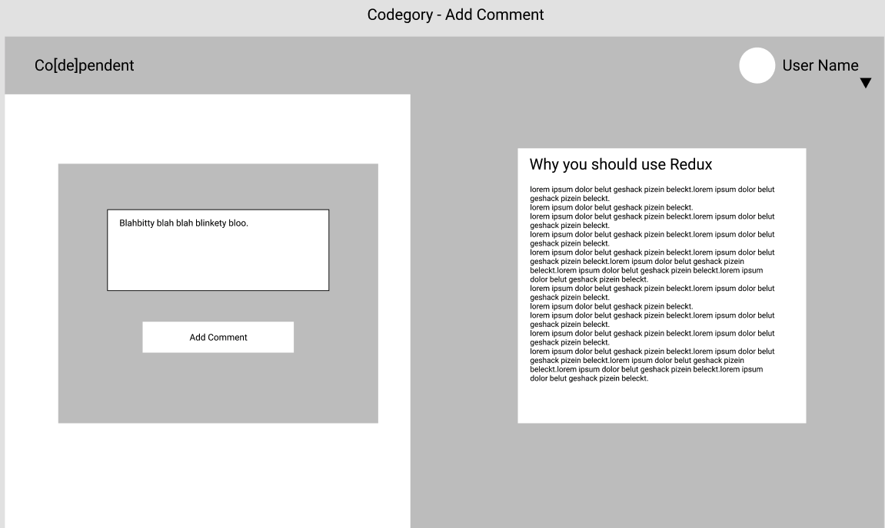
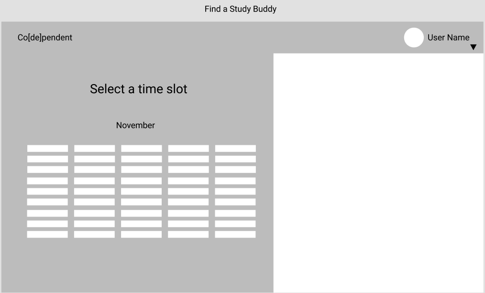
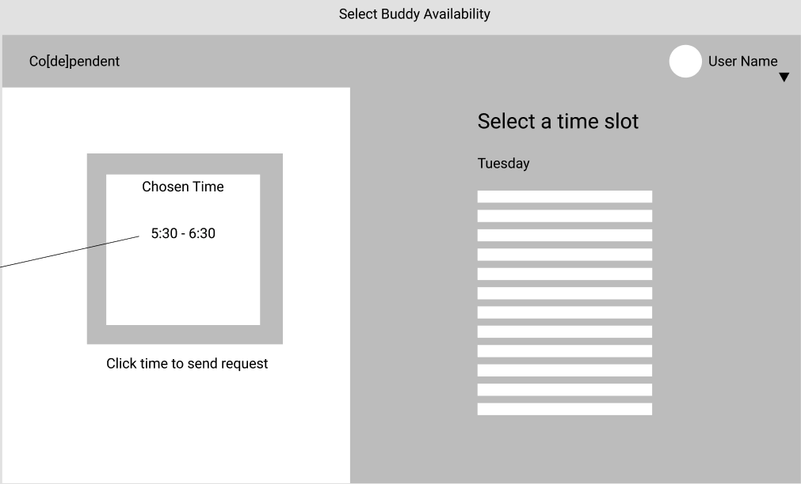
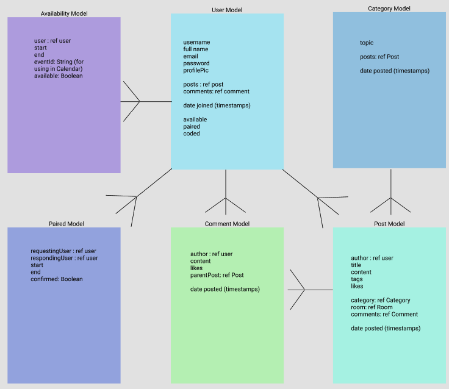

# co\[de\]pendent

Co\[de\]pendent is a place where technologically-inclined people can meet and foster their passion together. It's a place to share knowledge, resources, and advice with like-minded people who all have something to learn and teach.

## User Story

The user can sign up for an account and log in, being redirected to their profile page where they can see their information including their name and email, posts, comments, and an option to update their availability to study.

The user can update their availability by adding timeslots or removing them.

The user can see other users' available study sessions to find a study buddy.

The user can view all the "codegories" with the number of posts in each one.

The user can view posts in each codegory with information about when it was created and who wrote it. The user can add a post to a codegory, then edit or delete it. The user can not edit or delete another useer's post.

The user can view comments on each post page, add a comment, edit, and delete it, while not being able to edit or delte the comment of another user.

## Wireframes

## ERD

## Dependencies Installed

- bcryptjs

- jsonwebtoken

- body-parser

- express

- cors

- dotenv

- mongoose

- nodemon

- uuid

- node-sass

- nodemailer

- nodemailer-mailgun-transport

- FullCalendar

- React moment

- React Font Awesome

- React Bootstrap

## Technologies

- MongoDB/Mongoose, Express, React, NodeJS

## Future Features

- Users will see their availability in a list view on their profile page.

- Users will see upcoming available study sessions of all users.

- Users will be able to select an available study time of another user and select an overlapping timeframe during which they'd like to study together.

- Users will receive emails requesting a study session from other users. They will click a link to the co\[de\]pendent site where they can either confirm or decline the request.

- Users will be able to post projects they'd like to find partners for and collaborate together.
